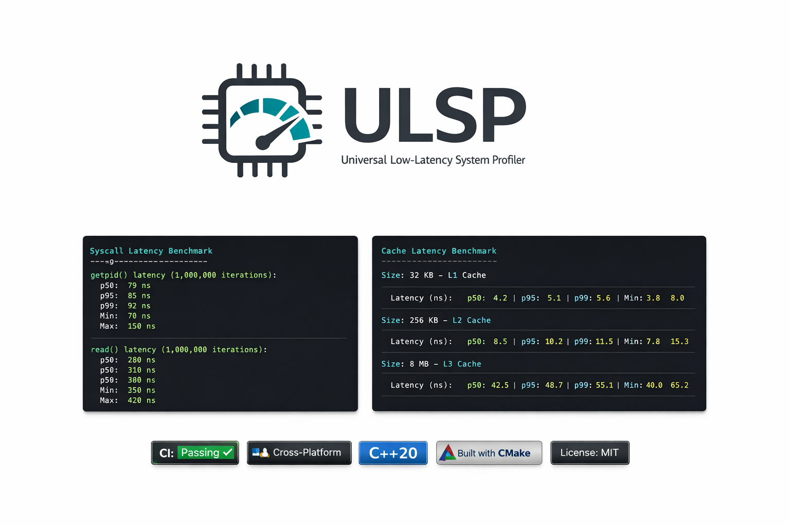

# **Universal Low-Latency System Profiler**

A modular C++20 framework for measuring microarchitectural and operating system latencies across **macOS**, **Linux**, and **Windows**. This tool provides precise insights into the cost of system calls, memory hierarchy access, context switching, and thread scheduling.

---

## **🚀 What It Offers**

This profiler is designed for systems engineers who need to know the *exact* cost of operations on specific hardware.

* **High-Resolution Timing**:  
  * **macOS**: mach\_absolute\_time (ns precision).  
  * **Linux**: clock\_gettime(CLOCK\_MONOTONIC\_RAW) (ns precision).  
  * **Windows**: QueryPerformanceCounter (QPC).  
* **Cache Hierarchy Profiling**: Implements pointer-chasing with random permutation to defeat hardware prefetchers, isolating true latency at L1, L2, and LLC levels.  
* **Context Switch Analysis**: Measures the cost of thread-to-thread (Mutex/CV) and process-to-process (Pipe) context switches.  
* **Memory Locality**: Quantifies the cost of "First Touch" (OS soft page faults) versus "Hot Access" (TLB hits).  
* **Core Pinning**:  
  * **macOS**: Thread Affinity Hints (P-core vs E-core scheduling).  
  * **Linux/Windows**: Strict Hardware Thread Pinning.  
* **Statistical Rigor**: Reports p50, p95, p99, and Mean to identify jitter and outliers.

---

## **🏗 Architecture & Design**

The project follows a **"Portable Core, Native Backend"** architecture.

* **src/core/**: Contains platform-agnostic logic (stats calculation, benchmark algorithms).  
* **src/platform/**: Contains OS-specific implementations:  
  * macos/: Mach kernel bindings.  
  * linux/: POSIX/vDSO bindings.  
  * windows/: Win32 API bindings.  
* **Zero-Copy Stats**: Benchmarks collect raw ticks in pre-allocated vectors. Conversion to nanoseconds and statistical analysis happens post-measurement to avoid "observer effect" pollution.

---

## **🛠 Prerequisites**

* **C++ Standard**: C++20 compliant compiler.  
  * **macOS**: Clang 10+ (Xcode 12+).  
  * **Linux**: GCC 10+ or Clang 10+.  
  * **Windows**: MSVC v142+ (Visual Studio 2019+).  
* **Build System**: CMake 3.20+.

---

## **⚡ Build Instructions**

**Critical:** You must build in Release mode. Debug builds (\-O0) introduce massive overhead that invalidates latency profiling.

### **macOS & Linux (Bash)**

Bash  
\# 1\. Clone the repository  
git clone https://github.com/your-org/system-profiler.git  
cd system-profiler

\# 2\. Create build directory  
mkdir build && cd build

\# 3\. Generate Build Files (Release Mode is Mandatory)  
cmake \-DCMAKE\_BUILD\_TYPE=Release ..

\# 4\. Compile  
make \-j$(nproc 2\>/dev/null || sysctl \-n hw.ncpu)

### **Windows (PowerShell)**

PowerShell  
mkdir build; cd build  
cmake \-DCMAKE\_BUILD\_TYPE=Release ..  
cmake \--build . \--config Release

---

## **💻 Usage**

Run the profiler using the generated executable.

### **Syntax**

Bash  
./profiler \<mode\> \[--core \<core\_id\>\]

*(On Windows, use profiler.exe)*

### **Modes**

* syscall: Measure OS call overhead (User \-\> Kernel transition).  
* cache: Measure memory latency from 32KB to 256MB.  
* context: Measure thread and process switching costs.  
* memory: Measure page fault and locality costs.  
* all: Run all benchmarks.

### **Examples**

**1\. Run all benchmarks:**

Bash  
./profiler all

**2\. Pin to a specific core (e.g., isolate Linux Core 2):**

Bash  
./profiler cache \--core 2

---

## **📊 Benchmark Methodology**

### **1\. Cache Latency (cache)**

* **The Problem:** Modern CPUs have aggressive hardware prefetchers that predict linear memory access patterns.  
* **Our Solution:** We allocate a buffer and treat it as a linked list of Node structs. We shuffle the links randomly. Walking this list forces the CPU to stall waiting for memory at every step, revealing the true latency of L1, L2, and RAM.

### **2\. Context Switching (context)**

* **Thread Switch:** Spawns two threads sharing a synchronization primitive (std::mutex/std::condition\_variable). Measures round-trip notification time.  
* **Process Switch:** fork() (or CreateProcess) and IPC pipes. Forces a full address space switch and TLB flush.

### **3\. Syscall Overhead (syscall)**

* **getpid()**: The canonical "fast" syscall. Measures the raw cost of switching from User Mode (Ring 3\) to Kernel Mode (Ring 0).  
* **read()**: Reads 1 byte from a null device (e.g., /dev/zero). Measures VFS layer validation costs.

---

## **⚙️ Platform Specifics**

| Feature | macOS (Apple Silicon) | Linux (x86\_64) | Windows (x86\_64) |
| :---- | :---- | :---- | :---- |
| **Page Size** | **16KB** (Usually) | 4KB | 4KB |
| **Pinning** | **Hint Only** (Scheduler decides) | **Strict** (Hard Lock) | **Strict** (Hard Lock) |
| **Syscalls** | read / getpid | read / getpid (vDSO optimized) | ReadFile / GetCurrentProcessId |
| **Core Types** | Asymmetric (P-Cores vs E-Cores) | Symmetric (Usually) | Symmetric (Usually) |

**Note on Apple Silicon:**

M-series chips have **Performance (P)** and **Efficiency (E)** cores.

* If you see unexpectedly high latency (e.g., Cache L1 takes 3x longer), you are likely on an E-core.  
* Use \--core \<N\> to test different cores. (High IDs are usually P-cores).

---

## **🎯 Practical Applications**

This framework is critical for:

1. **High-Frequency Trading (HFT):** Assessing the jitter and minimum latency floor of the hardware networking stack and OS scheduler.  
2. **Game Engine Development:** Budgeting frame time (16ms or 8ms) for AI and Physics subsystems by understanding memory access costs.  
3. **Real-Time Audio:** Ensuring audio callbacks can complete within the buffer deadline (e.g., 2.9ms for 128 samples).  
4. **Cloud Infrastructure:** Verifying that "vCPUs" in a cloud instance are pinned correctly and not suffering from "noisy neighbor" cache thrashing.  
5. **Hardware Evaluation:** Comparing memory subsystem performance between different chip architectures (e.g., x86 vs ARM64).

